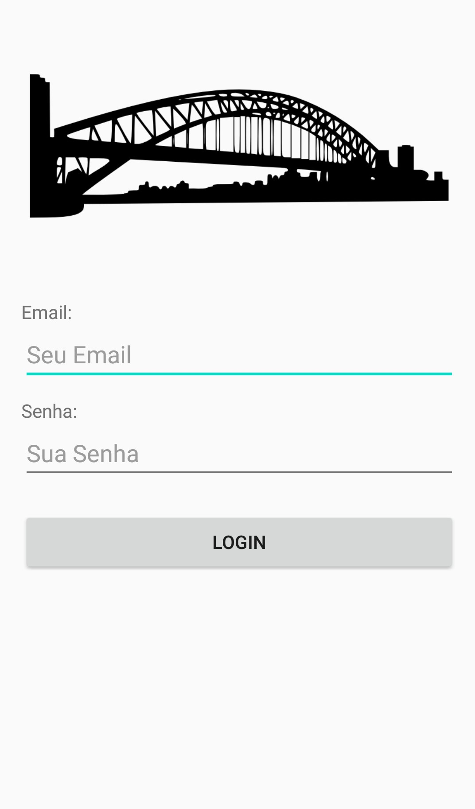

# Mini Curso Android

📱 Aplicação Android  
👩‍💻 Desenvolvida em Java  
🛠 No [Mini Curso Android](https://minicursoandroid.club.hotmart.com/)  
💻 Disponivel na [Hotmart](https://www.hotmart.com/pt-BR)

O curso mostrou os conceitos e componentes básicos para o desenvolvimento de aplicações desenvolvidas na plataforma [Android Studio](https://developer.android.com/studio).

No final um dos aplicativos desenvolvidos foi um controle de usuário. Com tela Splash, Home e Login.

  
  
  

